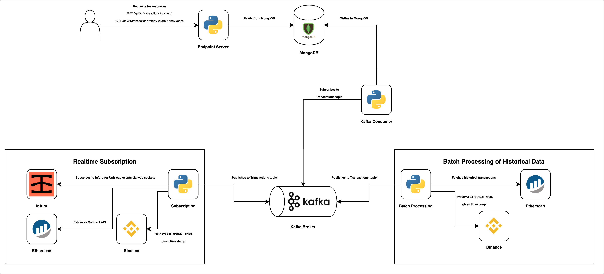

# Tokka Labs Software Engineering Challenge 1

## Overview

This project is a solution to the Tokka Labs Software Engineering Challenge 1.
It involves building a system that processes Ethereum transactions in real-time and historical data,
and integrates with various services such as Etherscan, Binance, and Infura. An API is also built to
provide a RESTful interface to query the processed data.

## Table of Contents

1. [Requirements](#requirements)
2. [Environment Setup](#environment-setup)
3. [Running the Application](#running-the-application)
4. [Design Considerations](#design-considerations)

## Requirements

Ensure that the following are installed on your device:

1. [Docker](https://docs.docker.com/get-docker/)
2. [Docker Compose](https://docs.docker.com/compose/install/)

## Environment Setup

1. Clone the repository:

```bash
git clone https://github.com/ztdevelops/tokka-labs-software-engineering-challenge-1.git
```

2. Change directory to the project root:

```bash
cd tokka-labs-software-engineering-challenge-1
```

3. Create a `.env` file in the project root and add the following environment variables:

```bash
MONGODB_URL=mongodb://root:password@db:27017
KAFKA_BROKER_URL=broker:9092
KAFKA_GROUP_ID=kafka-consumer-group
KAFKA_TOPIC=transactions
ETHERSCAN_CONTRACT_ADDRESS=0x88e6A0c2dDD26FEEb64F039a2c41296FcB3f5640
ETHERSCAN_CONTRACT_ABI_ADDRESS=0x8f8EF111B67C04Eb1641f5ff19EE54Cda062f163
ETHERSCAN_HISTORICAL_FIRST_BLOCK=0
ETHERSCAN_HISTORICAL_LAST_BLOCK=27025780
ETHERSCAN_HISTORICAL_BATCH_SIZE=10000
INFURA_POLL_INTERVAL=3
INFURA_PROJECT_ID=
ETHERSCAN_API_KEY=
```

Alternatively, copy and paste the `.env.example` file and rename it to `.env`.
Fill up the variables for `INFURA_PROJECT_ID` and `ETHERSCAN_API_KEY`.

## Running the Application

1. Start the application:

```bash
docker-compose -p tklbs up -d --build
```

2. Verify that the application has started successfully:

```bash
docker ps -a

# Output
CONTAINER ID   IMAGE                             COMMAND                  CREATED              STATUS                        PORTS                          NAMES
1a035e996412   tklbs-transactions-historical     "python3 src/main.py"    About a minute ago   Up 5 seconds                                                 tklbs-transactions-historical-1
6e963921a6b6   tklbs-message-consumer            "python3 src/main.py"    About a minute ago   Up 5 seconds                                                 tklbs-message-consumer-1
490de9b99f7e   tklbs-transactions-realtime       "python3 src/main.py"    About a minute ago   Up 5 seconds                                                 tklbs-transactions-realtime-1
f6b9ad98f60a   confluentinc/cp-kafka:7.6.3       "/etc/confluent/dock…"   About a minute ago   Up 36 seconds (healthy)       9092/tcp                       tklbs-broker-1
93c91d22f638   tklbs-endpoint-server             "fastapi run src/mai…"   About a minute ago   Up 36 seconds (healthy)       0.0.0.0:8000->8000/tcp         tklbs-endpoint-server-1
dcedb40378c2   confluentinc/cp-zookeeper:7.6.3   "/etc/confluent/dock…"   About a minute ago   Up About a minute (healthy)   2181/tcp, 2888/tcp, 3888/tcp   tklbs-zookeeper-1
f93d247fb660   mongo:8.0.3                       "docker-entrypoint.s…"   About a minute ago   Up About a minute (healthy)   27017/tcp                      tklbs-db-1
```

3. Access the API documentation at `http://localhost:8000/docs`.
   The endpoints supported are as follows:

- `GET /api/v1/transactions/{transaction_hash}`: Get a transaction by its hash.
-
`GET /api/v1/transactions?start_timestamp={start_timestamp}&end_timestamp={end_timestamp}=&page={page}&page_size={page_size}`:
Get transactions within a time range and paginated.

4. Tear down the application:

```bash
docker compose -p tklbs down -v
```

## Design Considerations

The application is designed to process Ethereum transactions in real-time and historical data.
It is composed of the following components:

1. **Message Consumer**: This component consumes messages from a Kafka topic and processes them.
2. **Transactions Historical**: This component fetches historical transactions in batches from Etherscan and writes them
   to Kafka.
3. **Transactions Realtime**: This component fetches real-time transactions with Infura and writes them to Kafka.
4. **Endpoint Server**: This component provides a RESTful interface to query the processed data.

### Architecture Diagram



### Decoupled components

The system was designed with decoupled components to ensure that each component is responsible for its own task. This
ensures that the components can be scaled individually and performs independent of each other. This is achieved through
having four different components with Kafka as the bridge for communication, allowing for an event-driven architecture
supporting asynchronous processing.

## NoSQL Database (MongoDB)

This system requires heavy read-write operations without the need to join records from different collections. MongoDB
was chosen as the database for this system due to its flexibility and scalability. It is a NoSQL database that stores
data in JSON-like documents, making it easy to store and retrieve data. It also supports horizontal scaling, which is
important for handling large volumes of data.

## Message Broker (Kafka)

Kafka was chosen as the message broker for this system for its partitioning, which is not supported by traditional
message brokers like RabbitMQ. This allows for the parallel processing of messages across multiple consumers, which is
important for scaling the system. Kafka also provides fault tolerance and high availability, ensuring that messages are
not lost in the event of a failure.

## Websockets

Websockets were used where we expect continuous data ingestion, such as with Infura for event consumption and Binance
for
fetching of ETH/USDT prices at specific timestamps. This minimises the overhead of establishing a new connection for
each
request, allowing for real-time data updates.